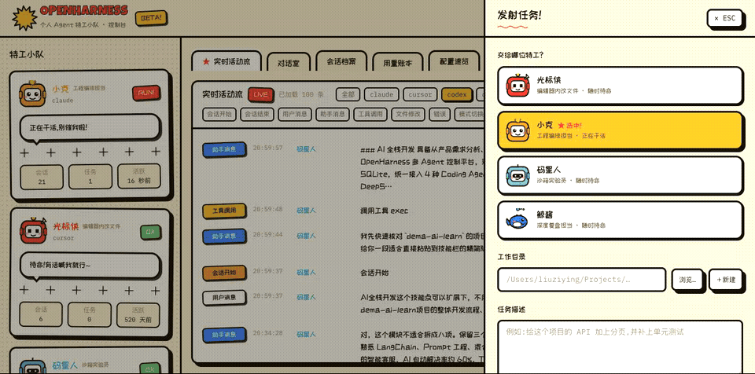
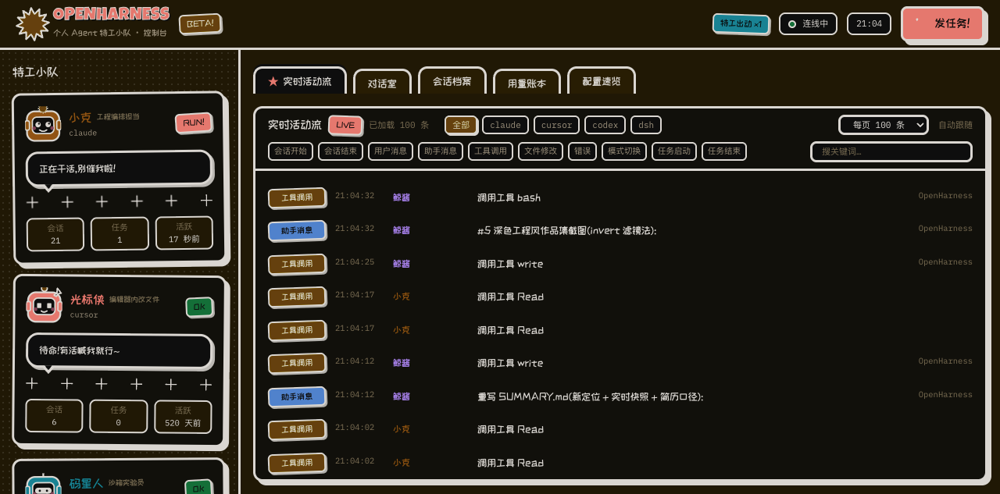
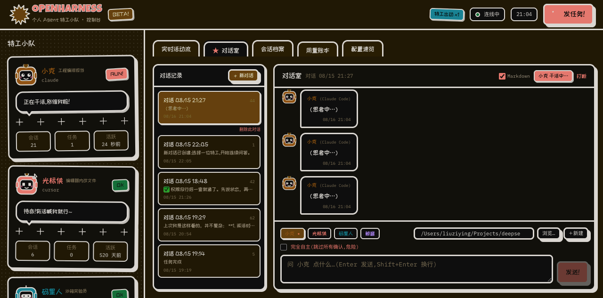
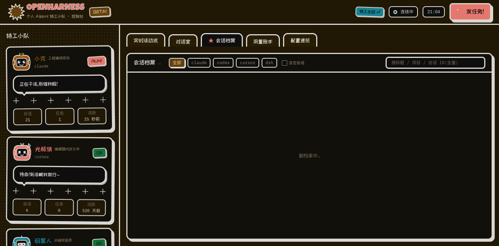
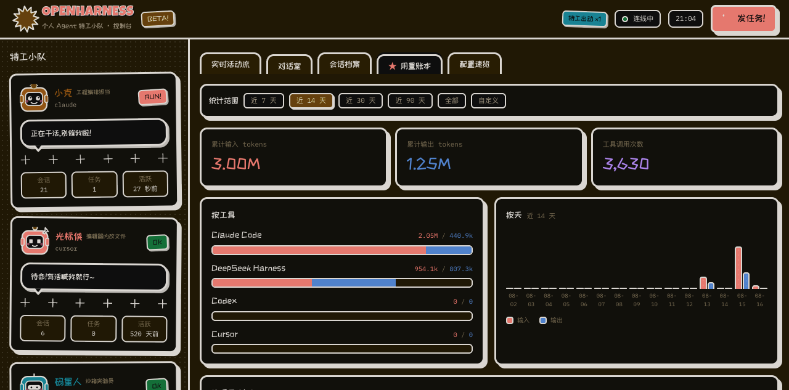
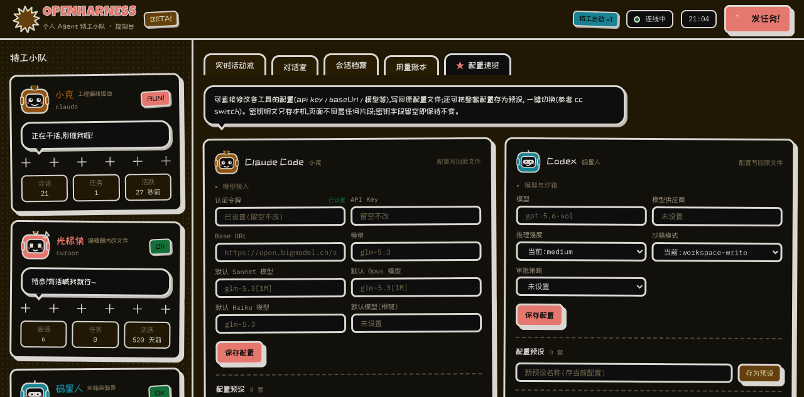

# OpenHarness

> **多 Agent 编排与可观测控制台(AI Coding Agent 控制面)** —— 一个页面,管理、操作、监控你的所有 AI 编程 Agent(Cursor · Claude Code · Codex · DeepSeek Harness),保留每个工具的原生特色。
> 项目**不重新实现模型层 Agent**(Planning / Tool Calling / Runtime 均为工具原生能力),而是解决异构适配、任务生命周期、会话状态、实时观测与安全边界问题。
> 当前版本:**v0.6.0**(变更记录见 [CHANGELOG](CHANGELOG.md))。

## 一分钟演示



## 它解决什么问题

同时使用多个 AI Agent 工具的人都有一个痛点:**任务散落在各个工具的会话里,谁在干什么、干到哪了、花了多少,没有全局视野**。OpenHarness 是这一层缺失的「控制面」:

- **一个页面看到全部**:四个 Agent 的实时活动流、状态卡、会话索引、用量统计;
- **一个页面发起任务**:选工具、写任务,页面按各工具特色给出建议,你来拍板;
- **随时回到原生体验**:任务进行中一键深链回 Cursor / 终端里的 Claude Code / Codex / DSH。

核心原则一句话:**OpenHarness 编排和观察工具本身,而不是用 API 重新实现它们。**

## 架构

```
┌─────────────────────────── 浏览器页面(React 19) ───────────────────────────┐
│  控制台首页 · 活动流 · 对话室 · 会话索引/详情 · 发任务(建议引擎)· 用量 · 配置 │
└───────────────────────────────┬─────────────────────────────────────────────┘
                         REST / WebSocket(实时推送)
┌───────────────────────────────▼─────────────────────────────────────────────┐
│                        OpenHarness Server(Hono + SQLite)                     │
│  事件总线(归一化+入库+广播)· 任务管理(发射/排队/打断/持久化)· 对话管理 ·      │
│  建议引擎 · 配置编辑与预设                                                     │
└───────┬──────────────────┬──────────────────┬──────────────────┬────────────┘
        │ CursorAdapter    │ ClaudeAdapter    │ CodexAdapter     │ DshAdapter
        │ conversation-    │ ~/.claude/       │ ~/.codex/        │ ~/.dsh/
        │ search.db        │ projects/*.jsonl │ sessions/**/*.jsonl│ sessions/**/*.zstd
        ▼                  ▼                  ▼                  ▼
  cursor-agent      claude -p          codex exec        dsh --profile headless
  (原生 CLI)        (stream-json)      (--json)          (原生 CLI)
```

- **适配器模式**:每个工具一个 Adapter,统一接口 `listSessions / indexEvents / watch / launch / resumeCommand / describeConfig / configSchema / updateConfig`,新增工具零改动核心;
- **统一事件模型**:所有工具的原生记录归一化为 `HarnessEvent`,活动流、用量、状态都建立在这一层;
- **只读 + 脱敏**:会话文件只解析不写入;配置页绝不展示密钥原文(编辑只回传"新值",留空不改);
- **本地优先**:数据不离开你的机器,凭据仍归各工具自己管理;配置预设(密钥快照)仅存 `~/.openharness/presets.json`。

## 功能全景

| 能力 | 说明 | 状态 |
|---|---|---|
| 实时监控 | 四工具会话文件监听 + 任务流式捕获 + 进程探测,统一活动流(WebSocket 推送) | ✅ |
| 活动流分页筛选 | 最新在前 + 游标「加载更早」+ 每页 50/100/200 + 10 种事件类型筛选 + 关键词搜索,「↑ 最新」浮钮一键回顶 | ✅ |
| 任务发射 | 经各工具**原生 CLI** 启动(`claude -p` / `codex exec` / `cursor-agent` / `dsh --profile headless`),保留 hooks/sandbox/plan 等全部原生能力;可选「完全自主」跳过所有权限确认(claude `--dangerously-skip-permissions` / codex `--dangerously-bypass-approvals-and-sandbox` / cursor `--yolo --sandbox disabled`) | ✅ |
| 任务排队 | 勾选「排队执行」,Agent 忙时 FIFO 入队,收尾自动接续 | ✅ |
| 打断/移除 | 进程组 SIGINT,状态正确归因(stopped vs error) | ✅ |
| 会话索引 | 4 工具会话统一索引(分页/全量搜索/时间线/统计;cursor 接入搜索库全文轨迹;空会话默认归档) | ✅ |
| 深链恢复 | `claude --resume` / `codex resume` / `cursor agent --resume` / `dsh --profile tui --resume`,一键复制或**直接在终端打开** | ✅ |
| 对话室 | 会话式连续问答:聊天气泡(Markdown+mermaid+KaTeX 渲染可开关,代码块复制)+ @mention 路由 + 送评审 + 原生 resume 续接上下文 + 会话内切换 Agent + 团队记忆注入 + 阶段标签 + 记住每个会话的特工与目录 | ✅ |
| 智能建议 | 关键词 × 工具特色矩阵评分,推荐 + 理由,人做决定 | ✅ |
| 用量统计 | 总量 / 按工具 / 按模型 / 按天 / 按项目 + **费用估算**(可配置价目表),范围可选(7/14/30/90 天/全部/自定义起止),含数据完整性标注 | ✅ |
| 配置编辑 | 四工具配置直接编辑(api key / baseUrl / 模型等),写回原配置文件,密钥**零片段回显**;特工角色卡可编辑并注入任务 | ✅ |
| 配置预设 | cc switch 式:整套配置一键存为预设、一键切换/删除,密钥仅存本机 | ✅ |
| 通知 | 浏览器通知 + 服务端 macOS 通知(terminal-notifier,点击直达控制台,浏览器关闭也提醒) | ✅ |
| 任务历史 | SQLite 持久化,重启保留,僵尸任务自动归位 | ✅ |
| 自动化测试 | vitest 39 项断言(解析器/游标续读/去重/任务状态机/密钥脱敏/配置补丁)+ GitHub Actions CI(typecheck/test/build/check:dates) | ✅ |

## 技术栈

TypeScript 全栈 · pnpm monorepo · Node.js ≥ 22 · Hono + WebSocket · React 19 + Vite + Tailwind CSS 4 · SQLite(better-sqlite3 / node:sqlite)· chokidar · fzstd(纯 JS zstd 解压)

选型论证见 [docs/stack-decision.md](docs/stack-decision.md)。

## 快速开始

```bash
pnpm install
pnpm dev:server        # http://127.0.0.1:3900(REST + WebSocket + 静态托管)
pnpm dev:web           # http://127.0.0.1:3901(前端热更新)
```

生产模式:`pnpm --filter @openharness/web build && pnpm start`

> Cursor 控制需先执行一次 `cursor-agent login`(CLI 与 IDE 登录态不共享)。

## 工程亮点

- **经过多轮真实使用反馈迭代(20+ 项反馈闭环,见 CHANGELOG),每轮端到端实测**;修出的真实 bug 本身就是最佳实践样本:任务 ID 归因断裂、进程探测字符串污染、SIGINT 状态竞态、文件游标跳过元数据、双通道重复入库、headless 权限拦截假完成、chokidar v4 glob 失效等;
- **统一事件模型 + 游标增量索引**:重启秒级续读,事件不重不漏;
- **安全边界**:服务仅监听 127.0.0.1;密钥永不回显(编辑只提交新值、预设快照本地落盘),配置接口 0 密钥泄漏;
- **设计**:「特工小队」漫画风——四工具角色化(光标侠/小克/码星人/鲸酱),奶油纸底 + 墨线描边 + 硬实影 + 高饱和撞色,支持 reduced-motion。漫画风为产品特色,作品集另备**深色工程风截图**(见下)。


### 作品集素材(深色工程风)

| 控制台首页 | 对话室 | 会话档案 | 用量账本 | 配置速览 |
|---|---|---|---|---|
|  |  |  |  |  |

## 文档

- [PRD](docs/prd.md) · [架构设计](docs/architecture.md) · [技术栈决策](docs/stack-decision.md)
- [开发规范](docs/harness/README.md)(反馈闭环 / 开发验证 / 提交规范 / 代码规范)· [用户反馈](docs/harness/user-question.md) · [变更记录](CHANGELOG.md)
- [项目总结(面试向)](docs/SUMMARY.md) · [简历口径与要点](docs/resume-bullets.md) · [讨论与迭代记录](docs/vision-discussion.md)

## Roadmap

- ✅ v0.3:对话室、配置编辑与预设、活动流分页筛选、用量范围、完全自主模式
- ✅ v0.4:Markdown 渲染、去重/注入分离、会话档案分页、密钥零片段、移动端响应式
- ✅ v0.5:自动化测试与 CI、一分钟演示 GIF、作品集深色截图、定位与简历口径统一
- ✅ v0.6:@mention 路由、送评审、角色卡、mermaid/KaTeX、团队记忆、费用估算、阶段标签
- v0.7:更多 Agent 工具(OpenCode / Aider…)、局域网远程访问、任务模板与自动化工作流
- v0.8:多机会话同步、Supervisor 编排层(候选,默认关闭自动执行)、Need Audit/公告板(候选)

## License

[MIT](LICENSE)
