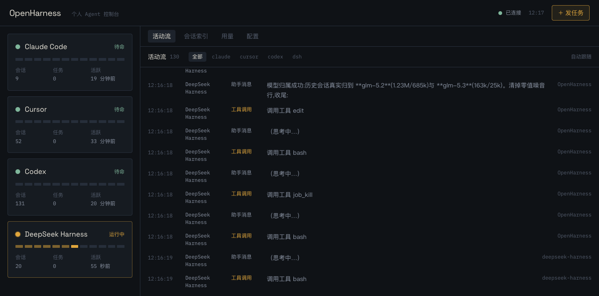

# OpenHarness

> **个人 Agent 控制台** —— 一个页面,管理、操作、监控你的所有 AI 编程 Agent(Cursor · Claude Code · Codex · DeepSeek Harness),保留每个工具的原生特色。



## 它解决什么问题

同时使用多个 AI Agent 工具的人都有一个痛点:**任务散落在各个工具的会话里,谁在干什么、干到哪了、花了多少,没有全局视野**。OpenHarness 是这一层缺失的「控制面」:

- **一个页面看到全部**:四个 Agent 的实时活动流、状态卡、会话索引、用量统计;
- **一个页面发起任务**:选工具、写任务,页面按各工具特色给出建议,你来拍板;
- **随时回到原生体验**:任务进行中一键深链回 Cursor / 终端里的 Claude Code / Codex / DSH。

核心原则一句话:**OpenHarness 编排和观察工具本身,而不是用 API 重新实现它们。**

## 架构

```
┌─────────────────────────── 浏览器页面(React 19) ───────────────────────────┐
│   控制台首页 · 活动流 · 会话索引/详情 · 发任务(建议引擎)· 用量 · 配置      │
└───────────────────────────────┬─────────────────────────────────────────────┘
                         REST / WebSocket(实时推送)
┌───────────────────────────────▼─────────────────────────────────────────────┐
│                        OpenHarness Server(Hono + SQLite)                     │
│   事件总线(归一化+入库+广播)· 任务管理(发射/排队/打断/持久化)· 建议引擎      │
└───────┬──────────────────┬──────────────────┬──────────────────┬────────────┘
        │ CursorAdapter    │ ClaudeAdapter    │ CodexAdapter     │ DshAdapter
        │ conversation-    │ ~/.claude/       │ ~/.codex/        │ ~/.dsh/
        │ search.db        │ projects/*.jsonl │ sessions/**/*.jsonl│ sessions/**/*.zstd
        ▼                  ▼                  ▼                  ▼
  cursor-agent      claude -p          codex exec        dsh --profile headless
  (原生 CLI)        (stream-json)      (--json)          (原生 CLI)
```

- **适配器模式**:每个工具一个 Adapter,统一接口 `listSessions / indexEvents / watch / launch / resumeCommand / describeConfig`,新增工具零改动核心;
- **统一事件模型**:所有工具的原生记录归一化为 `HarnessEvent`,活动流、用量、状态都建立在这一层;
- **只读 + 脱敏**:会话文件只解析不写入,配置页绝不展示原文,密钥统一脱敏;
- **本地优先**:数据不离开你的机器,凭据仍归各工具自己管理。

## 功能全景

| 能力 | 说明 | 状态 |
|---|---|---|
| 实时监控 | 四工具会话文件监听 + 任务流式捕获 + 进程探测,统一活动流(WebSocket 推送) | ✅ |
| 任务发射 | 经各工具**原生 CLI** 启动(`claude -p` / `codex exec` / `cursor-agent` / `dsh --profile headless`),保留 hooks/sandbox/plan 等全部原生能力 | ✅ |
| 任务排队 | 勾选「排队执行」,Agent 忙时 FIFO 入队,收尾自动接续 | ✅ |
| 打断/移除 | 进程组 SIGINT,状态正确归因(stopped vs error) | ✅ |
| 会话索引 | 4 工具 200+ 会话统一索引、搜索、详情(时间线/统计) | ✅ |
| 深链恢复 | `claude --resume` / `codex resume` / `cursor agent --resume` / `dsh --profile tui --resume`,一键复制或**直接在终端打开** | ✅ |
| 智能建议 | 关键词 × 工具特色矩阵评分,推荐 + 理由,人做决定 | ✅ |
| 用量统计 | 总量 / 按工具 / 按模型 / 近 14 天 / 按项目,含数据完整性标注 | ✅ |
| 配置只读 | 四工具配置结构化展示,密钥脱敏(泄漏检查 0 命中) | ✅ |
| 通知 | 浏览器通知 + 服务端 macOS 通知(浏览器关闭也提醒) | ✅ |
| 任务历史 | SQLite 持久化,重启保留,僵尸任务自动归位 | ✅ |

## 技术栈

TypeScript 全栈 · pnpm monorepo · Node.js ≥ 22 · Hono + WebSocket · React 19 + Vite + Tailwind CSS 4 · SQLite(better-sqlite3 / node:sqlite)· chokidar · fzstd(纯 JS zstd 解压)

选型论证见 [docs/stack-decision.md](docs/stack-decision.md)。

## 快速开始

```bash
pnpm install
pnpm dev:server        # http://127.0.0.1:3900(REST + WebSocket + 静态托管)
pnpm dev:web           # http://127.0.0.1:3901(前端热更新)
```

生产模式:`pnpm --filter @openharness/web build && pnpm start`

> Cursor 控制需先执行一次 `cursor-agent login`(CLI 与 IDE 登录态不共享)。

## 工程亮点

- **11 个 commit、11 轮迭代全部端到端实测**,修出的真实 bug 本身就是最佳实践样本:任务 ID 归因断裂、进程探测误报(PATH 字符串污染)、SIGINT 状态竞态、文件游标跳过元数据(截断文件产生"幽灵会话")、队列自计数、密钥过度/不足脱敏、用量重复计数;
- **统一事件模型 + 游标增量索引**:重启秒级续读,事件不重不漏;
- **安全边界**:服务仅监听 127.0.0.1,配置接口 0 密钥泄漏,凭据文件永不读取;
- **设计**:「任务控制舱」视觉方向 —— LED 信号表(每 Agent 一列,事件点亮)、琥珀/玉色信号灯、Space Grotesk × IBM Plex Mono,支持 reduced-motion。

## 文档

- [PRD](docs/prd.md) · [架构设计](docs/architecture.md) · [技术栈决策](docs/stack-decision.md)
- [项目总结(面试向)](docs/SUMMARY.md) · [讨论与迭代记录](docs/vision-discussion.md)

## Roadmap

- v0.3:费用估算(可配置价目表)、更多 Agent 工具(OpenCode / Aider…)、局域网远程访问
- v0.4:任务模板与自动化工作流、多机会话同步

## License

[MIT](LICENSE)
